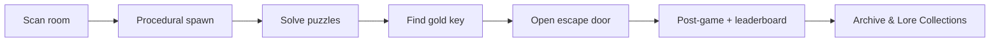

# Hexenfurt Memories - Escape Room Lens for the Snap Specs

Hexenfurt Memories is a procedural augmented-reality escape room for Snap
Spectacles, built in Lens Studio. The lens scans the room around you, spawns a
themed set of interactive objects and puzzles onto real surfaces, and challenges
you to find the gold key and escape before the timer runs out.

Each run lays the room out differently: the spawner picks objects, hides clues
inside them, and chains the puzzles together so the solution path changes from
session to session. After escaping you can revisit the objects you discovered in
the Archive Collection and read the lore you collected in the Lore Collection, both accessible through the Main Menu.

https://github.com/user-attachments/assets/495b0e3e-fff5-4424-845c-094cd43f50cd

## Gameplay loop



## Code overview

All gameplay logic lives in
[`Hexenfurt Memories/Assets/Scripts/TypeScript Codebase/`](Hexenfurt%20Memories/Assets/Scripts/TypeScript%20Codebase/).
The top-level managers are attached to objects in the scene; the per-object
puzzle scripts live in `Game Objects/` and are attached to the prefabs the
spawner instantiates.

| System | File(s) | Responsibility |
|--------|---------|----------------|
| Game flow | `GameFlow.ts` | State Machine, Escape Timer, Hint System, Tntro and Post-Game Pivots |
| Procedural layout | `ProceduralRoom.ts` | Room scan results to spawned objects, puzzle chaining, variety rules |
| UI and flow | `ViewController.ts` | UI Views & Logic |
| Hand menu | `HandMenu.ts` | In-Game menu |
| Progress | `PersistentStorage.ts` | Saved Stats, Progress Flags |
| Inventory | `InventoryManager.ts` | Pickups, Clues, and the Keys |
| World scan | `WorldQueryManager.ts` | Surface detection and anchor placement |
| Audio | `SoundManager.ts` | One-Shot and Spatial sound playback |
| Leaderboard | `SupabaseTable.ts` | Optional SnapCloud / Supabase score sync |
| Archive & lore | `ArchiveGallery.ts`, `LoreGallery.ts`, `ListManager.ts` | Post-game Galleries/Collections |
| Room Objects | `Game Objects/*RO.ts` | Per-Object interaction and puzzle logic |

`Game Objects/` also holds shared helpers (`RoomObjectAnimations.ts`,
`RoomObjectTesting.ts`, `HangSwing.ts`) used by several objects, and
`_globals.d.ts` documents the `global.*` bridge that lets scripts call into one
another.

## What's new in this update

This release is a full production pass on Hexenfurt Memories - not a patch, but a
ground-up refresh of art, content, architecture, and runtime behavior. Several objects 
are new to this update and participate in the spawn or decoration pipelines.


### TypeScript Port & Code Architecture

The entire gameplay codebase was migrated from JavaScript to **TypeScript** (~46
scripts, ~14k LOC). The original JS lives under `Assets/Scripts/legacy/` for
reference only; the live scene and all active prefabs are wired to the TypeScript
components in `TypeScript Codebase/`.

The old monolithic `Logic.js` was split into focused managers:

- **`GameFlow.ts`** — phase state machine, escape timer, hints, intro/outro
- **`ProceduralRoom.ts`** — room scan → spawn pipeline, puzzle chaining
- **`ViewController.ts`** — all UI views, transitions, menus, and post-game flow

Shared puzzle logic was extracted into reusable modules (`RoomObjectAnimations.ts`,
`RoomObjectTesting.ts`, `HangSwing.ts`, `PhysicsDebrisFade.ts`, `ItemSpot.ts`) so
individual room-object scripts stay small and consistent.

### Hi-fi Art Pass

Every core room object received a **remake prefab** under `Prefabs/_Remake Objects/`,
with updated meshes, materials, and textures. The procedural spawner now instantiates
these remakes instead of the older `*D1` prefabs. Static display variants (for the
Archive Collection gallery) live alongside them in `_Remake Objects/Static Prefabs/`.

Remade objects include the escape door, chest, key safe, code safe, bookshelf,
grand clock, drawer table, painting, vases, fan, chandelier, gramophone,
magic ball, and statue bust. Some of these are new to this update (Gramophone, Magic Ball, Vase Variants).

https://github.com/user-attachments/assets/f8e03de7-f639-46f1-83fd-c36b0d677f77

### Performance & Runtime Optimizations

- Spawn pipeline uses a **progressive load queue** with configurable delay, loading
  tips, and a progress bar driven by `ProceduralRoom` → `ViewController`.
- Spatial sounds are tracked by ID and stopped in bulk during post-game cleanup
  rather than left orphaned.
- Material cloning for physics debris (`PhysicsDebrisFade`) prevents shared-material
  side effects when objects shatter or topple.
- Decoration variety rules in `ProceduralRoom` prevent duplicate object types in
  the same run and respect first-game / round-based progression gates (some objects only spawn after the user has played a certain number of games).

## Project Structure

```text
Hexenfurt Update/
├── README.md
├── Hexenfurt Memories/                # Lens Studio project
│   ├── Hexenfurt Memories.esproj
│   ├── Assets/
│   │   ├── Scene.scene
│   │   ├── Scripts/
│   │   │   ├── TypeScript Codebase/   # ← active game code
│   │   │   │   ├── GameFlow.ts
│   │   │   │   ├── ProceduralRoom.ts
│   │   │   │   ├── ViewController.ts
│   │   │   │   ├── Game Objects/      # puzzle & decoration scripts
│   │   │   │   └── Helpers/
│   │   │   └── legacy/                # original JS (reference only)
│   │   ├── Prefabs/
│   │   │   ├── _Remake Objects/       # hi-fi remakes (active spawns)
│   │   │   └── ...                    # lore, decorations, sub-objects
│   │   ├── Meshes/  Materials/  Textures/  Sounds/  Fonts/
│   │   └── *.lspkg/                   # SIK, UIKit, LSTween, etc.
│   └── Cache/                         # generated (gitignored)
└── Resources/                         # Snap sample/reference material
```

## Reusable scripts

Several components in this project are designed to drop into other Spectacles
lenses with minimal wiring. They live in `TypeScript Codebase/` unless noted.

### UI & interaction

| Script | What it does | Reuse notes |
|--------|-------------|-------------| swap your view roots and button callbacks |
| **`RadialHoldButton.ts`** | Pinch-and-hold radial fill with kinematic progress curve; fires a callback on completion | Attach to any interactable; configure target time, boost, and material |
| **`HandMenu.ts`** | Palm-up toggle menu gated on game phase | Point `gameFlow` input at your phase controller |

### World & Spatial

| Script | What it does | Reuse notes |
|--------|-------------|-------------|
| **`WorldQueryManager.ts`** | Surface detection, anchor placement, pinch-to-snap, phase-specific placement guides | Requires World Query module; setup view root owned by ViewController |
| **`SurfaceAnchor.ts`** | Visual anchor marker with cloned material and `destroyAnchor()` helper | Drop on any placed anchor prefab |
| **`SmoothFollow.ts`** + **`FollowUtils.ts`** | Eased world-space follow (position + rotation) toward a target transform | Set target and speed; snaps instantly at speed ≥ 1 |

### Audio

| Script | What it does | Reuse notes |
|--------|-------------|-------------|
| **`SoundManager.ts`** | Background loops at start, on-demand spatial sounds with distance falloff, stop-by-ID tracking | Register sounds in inspector lists; call via `global.soundManager` |
| **`SoundAmbience.ts`** | Generic looping spatial ambience on any object (configurable sound ID + volume) | Replaces one-off scripts like FanAmbience; attach to any deco prefab |

### Physics & animation

| Script | What it does | Reuse notes |
|--------|-------------|-------------|
| **`ChainController.ts`** | Position-based-dynamics chain/rope simulation | Requires vendor PBD modules in `legacy/Helpers/`; attach link transforms |
| **`PhysicsDebrisFade.ts`** | Clones materials, fades opacity 1→0, then destroys debris objects | Import and call from any shatter/topple script |
| **`RoomObjectAnimations.ts`** | Shared LSTween builders: "shake when locked" wobble, "insert key + scale out" | Pass transforms and callbacks; used by chest, safes, door |
| **`HangSwing.ts`** | Pendulum rotation math for hanging objects | Import `computeHangRotation()`; tune via `@input` on the host component |

### Data & persistence

| Script | What it does | Reuse notes |
|--------|-------------|-------------|
| **`PersistentStorage.ts`** | Typed stat schema, seen-set tracking, first-game flags, lore ID normalization | Extend `STATS_SCHEMA`; access via `global.persistentStorage` |
| **`Util.ts`** | Delays, animation stepping, bulk scene-object helpers | Exposed as `global.utils`; used everywhere |

### Room-object building blocks

| Script | What it does | Reuse notes |
|--------|-------------|-------------|
| **`ItemSpot.ts`** | `@typedef` describing a slot inside a room object (decoration, item, or lore) | Reference from any RO's `@input itemSpots` array |
| **`ItemPickup.ts`** | Collectable item or clue note with tween-on-pickup | Spawn via ProceduralRoom or place manually |
| **`RoomObjectTesting.ts`** | Editor-only helper to fill item spots with test content | Enable `testItems` on any RO to preview in isolation |

---

Thanks for checking the repo out!
